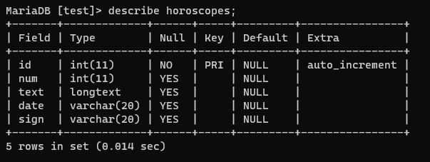

# horoscope
Horoscope Task

Il progetto è sviluppato in php nativo, database MariaDB, l'uso delle librerie è limitato a Bootstrap per un'impaginazione semplice ed efficace.
Essenzialmente si tratta di due pagine web visitabili index.php e horoscope.php : dalla index è possibile caricare il file horoscope.csv per andare a riempire di contenuti il database (precedentemente creato rispettando gli schemi di tabulazione proposti dal file csv).
Una volta popolato il database di records, dalla pagina horoscope.php è possibile calcolare il proprio segno zodiacale inserendo la data di nascita, e leggere
i relativi oroscopi giornalieri in ordine cronologico decrescente.

# struttura

La parte front-end del progetto è molto essenziale, divisa in tre file .php : header, navbar, footer.

Il file connect.php è quello che consente l'accesso al database: per testare il progetto è necessario personalizzare le credenziali di accesso.
Per questo progetto ho creato un database dal nome test, e una tabella di nome horoscopes, con le colonne id, num, text, date, e sign. 

Il file upload.php è il file action del form in index, destinato all'upload del file csv e all'inserimento nel database dei dati importati.

Il file functions.php comprende le funzioni necessarie alla pagina horoscope.php per poter leggere il valore degli input del form, calcolare il segno zodiacale, e andare a richiamare la query necessaria per la visualizzazione dei contenuti in pagina.

Il file get-signs.php è quello che contiene le queries necessarie per andare a selezionare in modo mirato i contenuti dal database.

Il file card.php predispone la visualizzazione (all'interno della pagina horoscope.php) dei contenuti richiamati dal database.
