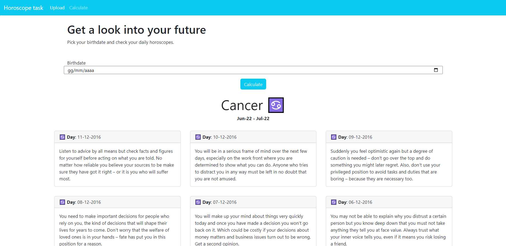

# Horoscope
Horoscope Task

Il progetto è sviluppato in php nativo, database MariaDB, l'uso delle librerie è limitato a Bootstrap per un'impaginazione semplice ed efficace.
Essenzialmente si tratta di due pagine web visitabili index.php e horoscope.php : dalla index è possibile caricare il file horoscope.csv per andare a riempire di contenuti il database (precedentemente creato rispettando gli schemi di tabulazione proposti dal file csv).
Una volta popolato il database di records, dalla pagina horoscope.php è possibile calcolare il proprio segno zodiacale inserendo la data di nascita, e leggere
i relativi oroscopi giornalieri in ordine cronologico decrescente.

# Struttura

La parte front-end del progetto è molto essenziale, divisa in tre file .php : header, navbar, footer.

Il file connect.php è quello che consente l'accesso al database: per testare il progetto è necessario personalizzare le credenziali di accesso.
Per questo progetto ho creato un database dal nome test, due tabelle horoscopes (con le colonne id, num, text, date, sign e foreign key zodiac_id), e zodiacs 
(con id, emoji, name, start_date, end_date). 

Il file upload.php è il file action del form in index, destinato all'upload del file csv e all'inserimento nel database dei dati importati.

Il file functions.php comprende le funzioni necessarie alla pagina horoscope.php per poter leggere il valore degli input del form, calcolare il segno zodiacale, e andare a richiamare la query necessaria per la visualizzazione dei contenuti in pagina.

Il file get-signs.php è quello che contiene le queries necessarie per andare a selezionare in modo mirato i contenuti dal database.

Il file card.php predispone la visualizzazione (all'interno della pagina horoscope.php) dei contenuti richiamati dal database.

# Aggiornamenti

1. Tabella horoscopes, colonna date cambiata da varchar(20) a date. Durante l'inserimento dei dati nel database (upload.php) aggiunto il metodo STR_TO_DATE alla query per poter inserire correttamente i valori nella colonna.
2. File get-signs.php aggiornato il metodo di visualizzazione della selezione: precedentemente era ordinato in num DESC, aggiornato a date DESC.
	Precedentemente, essendo date un campo varchar, l'ordine decrescente non corrispondeva all'ordine cronologico esatto: per ovviare a questo, avevo selezionato la colonna num ordine decrescente e l'ordine cronologico risultava corretto. 
3. Aggiunta una Join tra le due tabelle.
4. File card.php la data visualizzata nelle card rispetta il formato dd mm yyyy - Nome del segno, emoji e date del periodo sono prelevate dal database
5. Nuovo file admin/service-upload.php per importare nel database i dati contenuti nel file signs.csv - Non linkato nella navbar, perché intesa come pagina backoffice.
6. File upload.php aggiornato: quando viene importato il contenuto del file horoscopes.csv, i dati vengono modificati per poter associare l'id del segno zodiacale corrispondente (zodiac_id è la foreign key nella tabella horoscopes).
7. Pagina horoscopes.php inserito il date picker come selezionatore per la data di nascita. Adattamenti necessari nel file functions.php per la corretta lettura del valore in input.
8. Paginazione di horoscopes.php non ancora funzionante. Maggiori dettagli nei commenti al codice.
9. Tentate ottimizzazioni del codice, per evitare ripetizioni: tentativi non funzionanti commentati in file upload.php e get-signs.php

# Screenshots

 

 

 